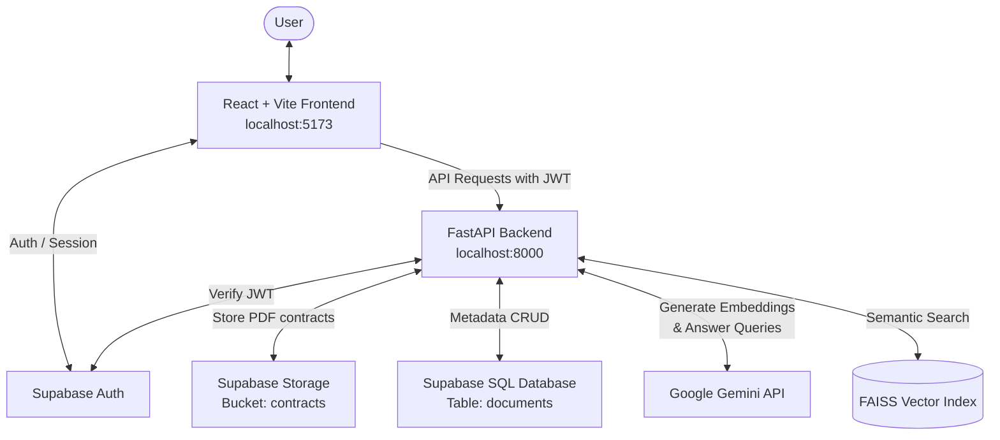

# ⚖️ Legal Contract Q&A Assistant — Project Analysis & Startup Guide

This document provides a comprehensive analysis of the **Legal Contract Q&A Assistant** project and detailed setup instructions to get both the frontend and backend services running.

---

## 🏗️ Project Architecture & Components

The application is split into a **FastAPI backend** (orchestrating the RAG pipeline, FAISS index, and Gemini API) and a **React + Vite frontend** (handling user interaction and Supabase authentication).



---

## 🛠️ Step-by-Step Setup Instructions

### 1. Supabase Backend Setup (Prerequisite)
The application relies on Supabase for User Auth, metadata storage, and PDF file hosting. You need to configure the following in your Supabase project:

#### A. Create the Database Table
Run the following SQL in your Supabase SQL Editor to create the `documents` table:

```sql
CREATE TABLE public.documents (
    id UUID PRIMARY KEY DEFAULT gen_random_uuid(),
    document_id UUID NOT NULL,
    user_id UUID NOT NULL REFERENCES auth.users(id) ON DELETE CASCADE,
    filename TEXT NOT NULL,
    storage_path TEXT NOT NULL,
    file_size BIGINT NOT NULL,
    indexed BOOLEAN NOT NULL DEFAULT true,
    uploaded_at TIMESTAMPTZ NOT NULL DEFAULT now()
);

-- Enable Row Level Security (RLS)
ALTER TABLE public.documents ENABLE ROW LEVEL SECURITY;

-- Select policy: users can view only their own documents
CREATE POLICY "Users can select their own documents" 
ON public.documents 
FOR SELECT 
TO authenticated 
USING (auth.uid() = user_id);

-- Delete policy: users can delete only their own documents
CREATE POLICY "Users can delete their own documents" 
ON public.documents 
FOR DELETE 
TO authenticated 
USING (auth.uid() = user_id);
```

#### B. Create the Storage Bucket
1. Navigate to **Storage** in your Supabase Dashboard.
2. Create a new bucket named **`contracts`**.
3. You can keep it private since the backend uses the **Service Role Key** (bypassing RLS) to upload and delete files.

---

### 2. Environment Configuration

#### Backend Configuration (`backend/.env`)
Create or edit [backend/.env](file:///Users/rahul/ml-training/bootcamp-ace-26-team-2/backend/.env):
```env
GEMINI_API_KEY=your_gemini_api_key_here
GEMINI_MODEL=gemini-2.5-flash

# Supabase
SUPABASE_URL=https://your-project.supabase.co
SUPABASE_SERVICE_ROLE_KEY=your-service-role-key-here
SUPABASE_STORAGE_BUCKET=contracts

# App Server Settings (defaults)
HOST=0.0.0.0
PORT=8000
FAISS_INDEX_PATH=app/vectorstore/faiss_index
```

#### Frontend Configuration (`frontend/legal-contract-qa/.env`)
Create or edit [frontend/legal-contract-qa/.env](file:///Users/rahul/ml-training/bootcamp-ace-26-team-2/frontend/legal-contract-qa/.env):
```env
VITE_SUPABASE_URL=https://your-project.supabase.co
VITE_SUPABASE_ANON_KEY=your-anon-public-key-here
```

---

### 3. Running the Startup Script

We have provided a unified startup script [start.sh](file:///Users/rahul/ml-training/bootcamp-ace-26-team-2/start.sh) at the root of the workspace. It will:
1. Validate that `python3`, `node`, and `npm` are installed.
2. Initialize and configure the Python virtual environment (`.venv`) and install backend packages.
3. Automatically copy `.env.example` configurations if missing.
4. Install frontend npm packages.
5. Start both servers concurrently (Backend on `8000`, Frontend on `5173`) with custom logging.
6. Gracefully shut down both servers when you press `Ctrl+C`.

To run it, execute:
```bash
./start.sh
```

---

### 4. Optional: Indexing the CUAD Dataset
The project includes a copy of the **Atticus Contract Understanding Dataset (CUAD)** in `backend/data/CUAD`. If you want to seed your local FAISS index with these contracts before starting, run:

```bash
cd backend
source .venv/bin/activate
python -m scripts.build_index
```
*(Make sure `GEMINI_API_KEY` is set in your `backend/.env` before running this, as it generates embeddings via the Gemini API).*
